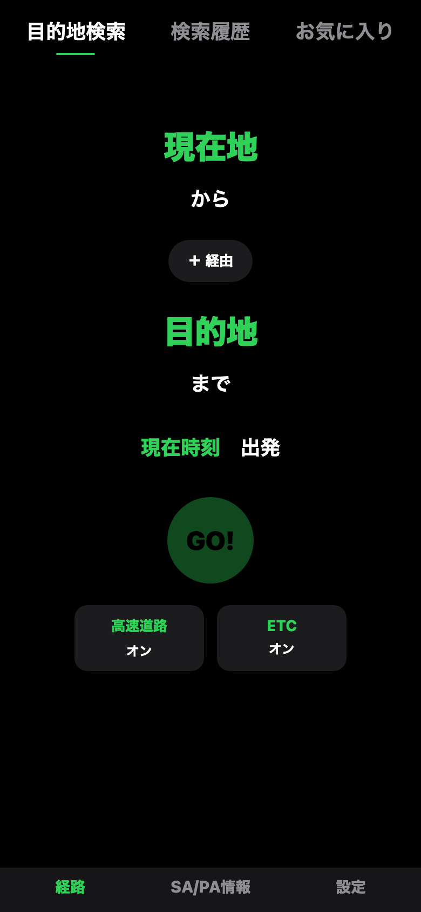

# Driver Copilot（TruckCopilot）

長距離トラックドライバー向けの**音声ファースト型ナビゲーション**を目指すモノレポです。法定休憩を意識したルート提案・SA/PA 情報・ハンズフリー操作などを、Expo（React Native）クライアントとローカル API スタブで開発します。

UI のトーン・カラー・タイポの正はリポジトリ直下の **[`DESIGN.md`](./DESIGN.md)** を参照してください。

## スクリーンショット

メイン画面（経路タブ・目的地検索）のプレビューです。



画像は **Expo の Web エクスポート**を静的配信し、**Playwright（Chromium）**で iPhone 相当のビューポート（390×844、deviceScaleFactor 2）を切り取っています。フォントやネイティブコントロールは iOS シミュレータと完全一致しませんが、README 用にリポジトリ内だけで再生成できます。

再生成（リポジトリルート）:

```bash
npm install
npx playwright install chromium   # 初回のみ
npm run capture-readme-screenshots
```

出力は `docs/readme/screenshot-app-main.png`。一時的な Web ビルドは `docs/readme/.web-build/` に置かれ、`.gitignore` で除外されます。

---

## リポジトリ構成

| ディレクトリ | 説明 |
|-------------|------|
| [`expo/`](./expo/) | Expo 54 / React Native 0.81 のモバイルアプリ本体 |
| [`server/`](./server/) | Express によるローカル開発用 API スタブ（`server.mjs`） |
| [`video/`](./video/) | Remotion ベースのデモ・LP 用動画プロジェクト |
| [`voicevox/`](./voicevox/) | VOICEVOX 連携（MCP 等） |
| [`infra/`](./infra/) | Docker / Terraform などのインフラ雛形 |
| [`.kiro/`](./.kiro/) | Spec-Driven 開発用の steering / specs |

クライアント内のコードは **`expo/src/features/<機能名>/`** にフィーチャー単位でまとまっています（画面・フック・API クライアント・テストのコロケーション）。

---

## 前提条件

- **Node.js 20+**（Expo 54 推奨環境）
- **npm**（各パッケージで利用）
- 実機・シミュレータ開発: **Xcode**（iOS）、**Android Studio**（Android）
- 音声合成をローカルで試す場合: **Docker**（[`infra/docker/voicevox/`](./infra/docker/voicevox/)）

---

## クイックスタート

### 1. API スタブを起動（別ターミナル）

```bash
cd server
npm install
npm start
```

既定ではクライアント側のフォールバック URL と合わせるため、**`EXPO_PUBLIC_API_BASE_URL` で実際のホストを指定**することを推奨します（後述）。

### 2. Expo アプリを起動

```bash
cd expo
npm install
npm run start
```

開発メニューから **iOS シミュレータ / Android エミュレータ / 実機（Expo Go または dev build）** を選んで起動します。

```bash
# 開発ビルドで直接起動する例
npm run ios
npm run android
```

### 3. Web で UI を確認する（任意）

地図は **`react-native-maps` が Web 非対応**のため、Web ではプレースホルダ表示になります。レイアウトやナビ周りの画面確認用として使えます。

```bash
cd expo
npm run start
# ターミナルで w を押す、または
npx expo start --web
```

初回のみ Web 用依存が必要な場合:

```bash
cd expo
npx expo install react-native-web react-dom @expo/metro-runtime
```

---

## 環境変数（Expo）

[`expo/src/features/navigation/navigationApiClient.ts`](./expo/src/features/navigation/navigationApiClient.ts) などで参照されます。開発時は `expo/` 直下に **`.env`** を置き、Expo の `EXPO_PUBLIC_*` 規約に従って設定します。

| 変数 | 説明 |
|------|------|
| `EXPO_PUBLIC_API_BASE_URL` | バックエンドのベース URL（未設定時はコード内のフォールバック） |
| `EXPO_PUBLIC_GOOGLE_MAPS_API_KEY` | Google Maps 系 API 利用時のキー（必要な機能向け） |

実機から Mac の API に繋ぐ場合は、`localhost` ではなく **LAN の IP アドレス**（例: `http://192.168.1.x:8080`）を指定してください。

---

## よく使うコマンド（`expo/`）

| コマンド | 説明 |
|----------|------|
| `npm run start` | Expo 開発サーバ起動 |
| `npm run start:go` | トンネル付きで起動（`expo start --tunnel`） |
| `npm run ios` / `npm run android` | ネイティブラン |
| `npm run typecheck` | TypeScript（`tsc --noEmit`） |
| `npm run lint` | ESLint |
| `npm test` | Jest |

Web 向けに静的エクスポートする例:

```bash
cd expo
npx expo export --platform web
```

---

## 仕様・開発プロセス

- **エージェント / コーディング規約**: [`AGENTS.md`](./AGENTS.md)
- **プロダクト・技術・ディレクトリ方針**: [`.kiro/steering/`](./.kiro/steering/)
- **機能ごとの仕様**: [`.kiro/specs/`](./.kiro/specs/)

Kiro 形式のワークフロー（要件 → 設計 → タスク → 実装）は `AGENTS.md` と `.cursor/skills` / `.claude/skills` のスキル定義に従います。

---

## トラブルシューティング

| 症状 | 確認すること |
|------|----------------|
| API に繋がらない | `server` が起動しているか、`EXPO_PUBLIC_API_BASE_URL` が実機から到達可能なホストか |
| Web バンドルで `react-native-maps` エラー | `NavigationMapView.web.tsx` が使われているか（Expo の platform 解決）。キャッシュ疑いなら `npx expo start -c` |
| 音声認識・位置情報 | 実機の権限設定、および Web では未対応・制限がある機能に注意 |

---

## ライセンス

未設定の場合はリポジトリ管理者に確認してください。
